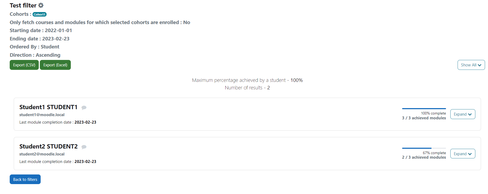
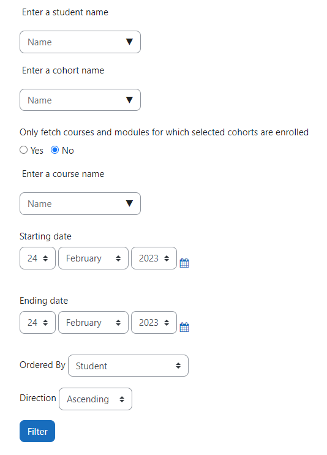

# Moodle Report ModuleCompletion

The `report_modulecompletion` plugin is an essential tool for Moodle users who want to monitor the progress of their students. This plugin is designed to track the progression of students in all of their courses for a given period. The plugin is particularly useful for teachers and other educators who need to keep track of student progress and identify areas where students may be struggling.

## Installation & Configuration

You can install this plugin like any other Moodle plugin although you must have Moodle 4 or above to use this plugin. Even though it was created (and was working) prior to Moodle 4 we only decided to support v4 and above to avoid too much maintenance.

Either download the package from the Moodle plugins repository page or from the Github page of the plugin.

Once installed, you will have to choose which modules/activities you would like to track on your platform; by default, all modules will be checked. **Keep in mind that you will need to come back to the settings page and check any module/activity you might install in the future and want to track.**

In order to be accessible by whomever needs access, administrators will have to add the `report/modulecompletion:view` capability to roles.

Users with access will then be able to use the plugin via **Site administration** > **Reports** > **Tracking module completion (under “Module reports” category)**

## Usage

### Filters

The entry point is through filters. They will allow you, as the name intends, to filter your results. You might want to follow specific students or a whole cohort or even track progression for a specific course. You can **save**, and **duplicate** your filters. You also can make a quick filter that you can save afterwards, or not.

Here are all the filters explained:

- **Student**: you can pick one or more students for whom you want to track module completion. Suspended users and teachers will not be listed.
- **Cohort**: if you enroll your students via cohorts you can pick one or more cohorts you want to track.
- **Only fetch courses and modules for which selected cohorts are enrolled**: simple “Yes or No” question. Check **Yes** if you only want to only display the courses associated with the selected cohorts. If you check **No**, you will also have courses for which selected cohorts’ students have completed modules and which (the courses) might not be associated with the selected cohorts.
- **Course**: select only the courses you want to track
- **Starting date**: you can only track progression for a specific period; you will have to pick a starting date for this period, for example the beginning of the year or the first day of the month.
- **Ending date**: the ending date for the period. You can select a date future date, like the end of the year if you want to track an entire year or the end of the month for example.
- **Order**: you can order the results either by student’s name, completion percentage or date of the last completion.
- **Direction**: ascending or descending order.

**Combining filters**

If you decide to combine filters, more specifically **students, cohorts** and **courses**, you might have less results that what you were expecting. If you select students via the students and cohorts, they will combine fine. However if you add courses filter, you will restrict your results to only the selected courses, meaning that selected students who are not enrolled in selected courses will not appear in the results.

Important notes

- Students with no completed modules/activities during the chosen period **will not** appear in the results.
- Even though a given student might have completed all of their courses modules, if you have not selected the right period in your filter, the student’s progression will not be a 100%. Meaning the starting date should be before the student’s first completion, and the ending date after the last completion. Of course if you want to check what modules/activities a student has completed for let us say, a specific month, you should not be surprised that modules/activities completed before and after the chosen month won’t be present in the results.
- **This goes without saying BUT, the more students you select and the wider your period is, the longer it will take to load the results. Depending on your server configuration, you might run into timeout problems. In that case, you should consider splitting your filters.**

**Exports**: you can exports your results in either in CSV or XLSX (Excel) if you need to deeper analyze students results with other tools. Note that it will take as much time to generate exports file as it take to load the results in Moodle.

### Metadata

This plugin is compatible with the `local_metadata` plugin: [https://moodle.org/plugins/local_metadata?lang=en_us](https://moodle.org/plugins/local_metadata?lang=en_us)

Even though the plugin has never been released in a stable state, we use it on a daily bases as it covers our needs. We need to keep track of the time spent on each module for our students, especially for those with financial aid. `local_metadata` allows us to affect time (in minutes) to each module. It took some time but every module that needed to have a hypothetical time now has it.

If you decide to use the metadata plugin (or that you are already using it), you will be able to combine it with this plugin, at least for modules metadata.

**For administrators**: Once the metadata plugin is installed, go to **Site administration** > Reports > **Settings (under “Module reports”)**, you will have to check **Use metadata plugin**.
Then go back to **Reports**, and click on **Metadata settings (under “Module reports”)**. On this page, you shall be able to select which module metadata you wish to display in your reports.
You will also be able to specify which of these metadata are numerical so you can perform conversion on them as it is explained in the settings description. We use it to convert our “time” metadata, which is by default in minutes, to hours. In the end, the conversion will be applied to each student and to each course. Modules will still display the unconverted value.

### Contributing

If you wish to contribute, you can report bugs on the issue tracker and make pull requests.
